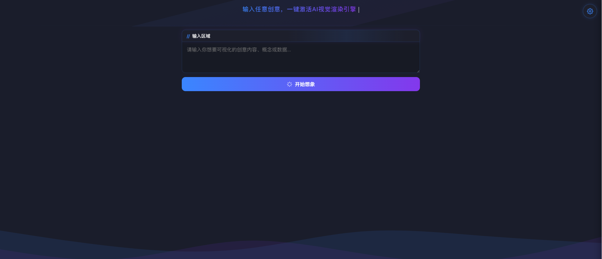

# html2card (Visual Expert)

一键将文本创意转化为精美HTML可视化页面的工具。利用AI能力，自动生成移动端友好、独立渲染的网页，无需编程知识。

## 主要特点

- **实时可视化**：输入任意文本，AI立即生成对应的HTML视觉表现
- **移动优先设计**：所有生成内容默认为移动端竖屏优化
- **完全独立**：生成的HTML文件自包含，无需任何外部依赖
- **右键截图**：预览区域支持一键截图拷贝功能
- **跨平台兼容**：支持PC和移动端设备使用

## 快速开始

1. 打开HTML文件，无需安装任何软件
2. 点击设置按钮（右上角齿轮），配置API信息
3. 在输入区域输入你的创意内容
4. 点击"开始想象"按钮生成可视化页面

## API设置

- **API Key**：输入你的大模型API密钥
- **API Base URL**：填写API基础地址（如：https://api.openai.com/v1）
- **模型**：选择合适的模型（如：gpt-4-turbo, deepseek-chat等）

## 高级设置

- **Max Token**：控制输出内容的最大长度（默认8192）
- **System Prompt**：自定义系统提示词，定制生成风格

## 使用技巧

- 使用Ctrl+Enter快捷键触发生成
- 预览区域可右键复制为图片
- 生成的HTML可通过"下载"按钮保存为独立文件
- 移动设备上长按预览区域可触发截图

## 技术说明

本工具采用纯前端实现，通过调用OpenAI兼容的API接口将文本转化为HTML。所有生成内容在本地运行，确保您的创意安全且私密。适用于设计师、内容创作者和产品经理快速可视化创意。

## 作者

熊猫大侠 | 公众号：PandaAI
